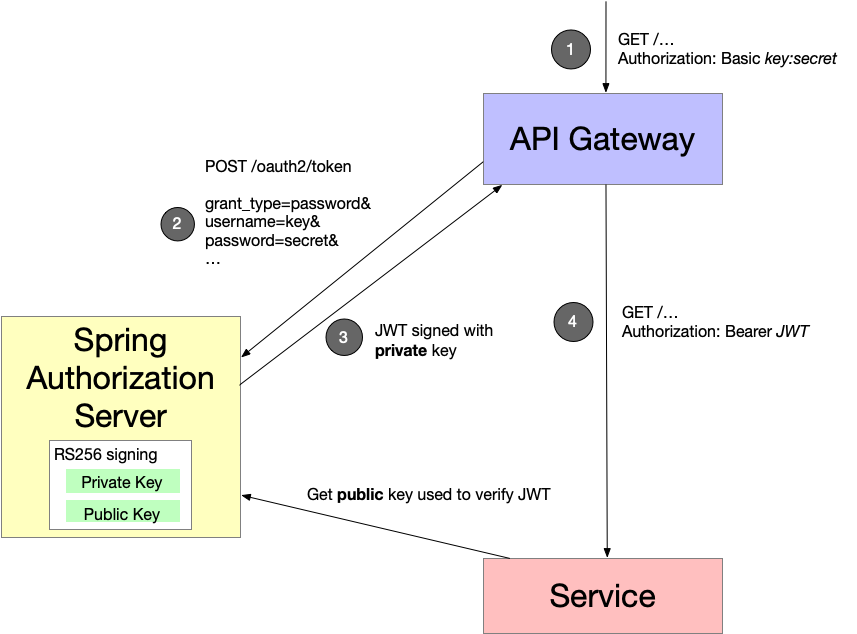

# Eventuate Examples Spring Authorization Server

This repository publishes a version of the https://spring.io/projects/spring-authorization-server[Spring Authorization Server] for use by the Eventuate example applications.
It has the following features:

* Extends Spring Authorization Server to support password grants
* Publishes a container image 
* Defines a Testcontainers extension for using the Spring Authorization Server in JUnit tests


## Adds support for password grants

This repository adds support for password grants to Spring Authorization Server.
Password grants support the following use cases:

* API Gateway needs to authenticate an API key and secret and generate a JWT that can be passed to downstream services.
* JUnit tests for a service (whose API requires a JWT) that needs to generate a JWT using a password grant.

One use case for using password grants is shown in the following diagram:



The flow is as follows:

1. Client makes request to API Gateway using Basic authorization, an API key and secret
2. API Gateway authenticates the API key and secret using the Spring Authorization Server and obtains a JWT
3. API Gateway forwards the request to a downstream service, passing the JWT
4. Downstream service validates the JWT using the public key obtained from the Spring Authorization Server

## Container image

This project publishes a container image to Docker Hub: https://hub.docker.com/r/eventuateio/eventuate-examples-spring-authorization-server

```
docker run eventuateio/eventuate-examples-spring-authorization-server:0.1.0.BUILD-SNAPSHOT
```

## Test-container extension for using the Spring Authorization Server in JUnit tests

This repository also defines a https://testcontainers.com/[Testcontainers] extension for using the Spring Authorization Server container in service integration, component and end to end tests.

There are two subclasses of `GenericContainer`:

* `AuthorizationServerContainerForLocalTests` - for tests where the Service-Under-Test runs in the JUnit JVM (e.g. an integration test) and the  Authorization Server is accessible via `localhost`. The `issuer-uri` is `http://localhost....`.

* `AuthorizationServerContainerForServiceContainers` - for tests where the Service-Under-Test is running as a container (e.g. component and end to end tests) and the Authorization Server is accessible via `authorization-server`. The `issuer-uri` is `http://authorization-server....`.

## Acknowledgements

The password grant code is based on the code sample provided by https://github.com/akuma8[akuma8] this https://stackoverflow.com/a/76335287[Stackoverflow post], which references this https://gist.github.com/akuma8/2eb244b796f3d3506956207997fb290f[Gist]

